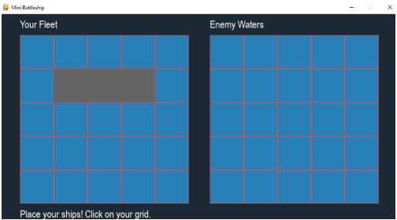
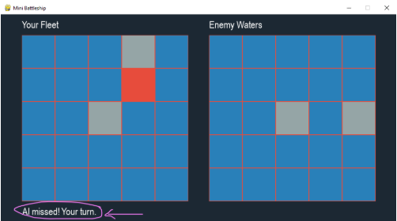
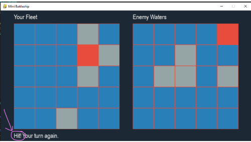
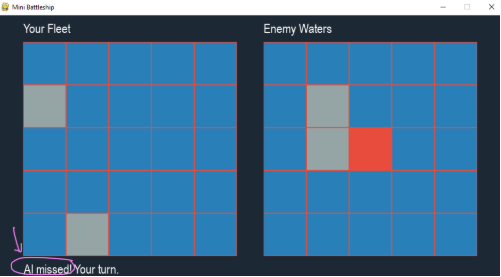
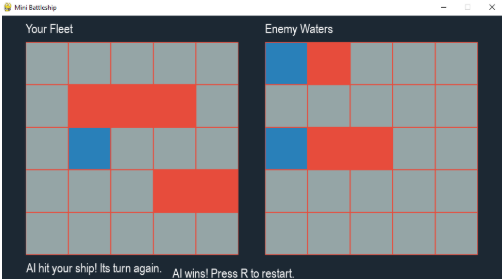
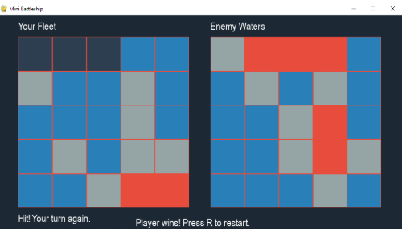

# Mini Battleship

### Submitted By:

- **Muhammad Shahzad (22k-4565)**

### Group Members:

- Umer Razi (22k-4451)
- Huzaifa Sohail (22k-4450)
- Taushar Lekhraj (22k-4532)

### Course: AI

**Instructor**: Talha Shahid  
**Submission Date**: May 11, 2025

---

## **1. Introduction**

The **Mini Battleship** project is a simplified, AI-enhanced version of the classic Battleship game. Played on a 5×5 grid, it features a probability-based AI that adapts its strategy based on hits and misses. This README documents the implementation, AI methodology, challenges, and results of the project.

---

## **2. Project Overview**

### Objectives:

- Develop an interactive Mini Battleship game with a GUI using **Pygame**.
- Implement an AI opponent that uses a probability-based attack strategy.
- Ensure the game is fast-paced and challenging for human players.

### Key Features:

- **5×5 Grid**: Smaller than traditional Battleship for quicker gameplay.
- **Two Ship Sizes**:
  - 2-cell ship
  - 3-cell ship
- **Probability-Based AI**:
  - Starts with random guesses.
  - Adjusts strategy based on hits (targeting adjacent cells).
  - Avoids redundant moves.
- **Interactive GUI**:
  - Ship placement phase:  
    
  - Turn-based attacks:  
    
  - Visual feedback (hits and misses):  
      
    
- **Winner Confirmation**:
  - **AI Wins**:  
    
  - **Player Wins**:  
    

---

## **3. AI Methodology**

### Probability-Based Strategy:

The AI uses a **heatmap approach** to determine the best attack locations:

1. **Initial Phase**:
   - Random guesses to gather data.
2. **Hit Detection**:
   - If a hit occurs, the AI increases probability in adjacent cells.
3. **Targeting Logic**:
   - After a hit, the AI prioritizes nearby cells to sink the ship.
4. **Adaptive Updates**:
   - Eliminates already-attacked cells from future moves.

### Heuristics:

- **Hit Probability Adjustment**:
  - Cells near hits get higher weights (_probability × 2_).
- **Ship Placement Rules**:
  - AI avoids impossible placements (e.g., overlapping ships).
- **Efficiency**:
  - **Time Complexity**: O(n²) per move (where n = grid size).

---

## **4. Implementation**

### Technologies Used:

- **Python**: Primary language.
- **Pygame**: GUI development.
- **NumPy**: Grid and probability calculations.
- **Random**: Initial AI guesses.

---

## **5. Challenges & Solutions**

| Challenge                          | Solution                                                         |
| ---------------------------------- | ---------------------------------------------------------------- |
| AI getting stuck after a hit       | Implemented adjacent-cell targeting to ensure follow-up attacks. |
| Probability matrix becoming stale  | Reset probabilities after each move to avoid redundant guesses.  |
| GUI responsiveness during AI turns | Added a small delay (`pygame.time.delay`) for better UX.         |
| Ship placement validation          | Used **NumPy** checks to prevent overlaps and invalid positions. |

---

## **6. Conclusion**

The **Mini Battleship** project successfully delivers a fast-paced, AI-driven version of the classic game. The probability-based AI provides a challenging opponent, while the **Pygame GUI** ensures an engaging user experience.

### Future Work:

- Scalability to larger grids.
- Multiplayer support.
- Enhanced visuals and animations.

---

## **7. References**

- [Pygame Documentation](https://www.pygame.org/docs/)
- [NumPy Documentation](https://numpy.org/doc/)
- [Battleship Game Rules](<https://en.wikipedia.org/wiki/Battleship_(game)>)

---

## **Appendix: Code Repository**

The full source code is available at:  
[Mini Battleship Code Repository](https://drive.google.com/file/d/1wtnlY67JsuSzMkm9CGaMnS8A2vjJaNGr/view?usp=drive_link)
